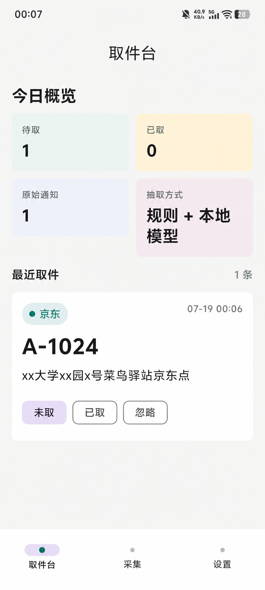
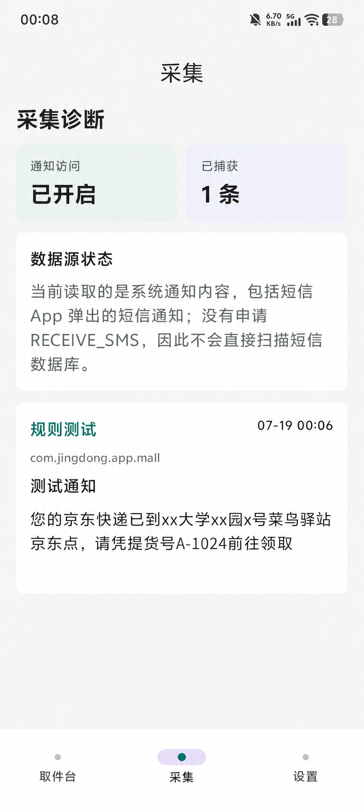
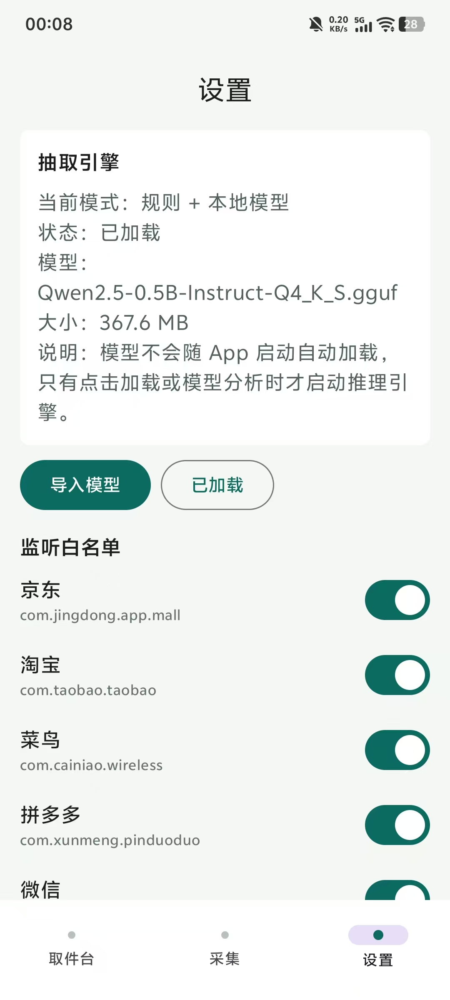
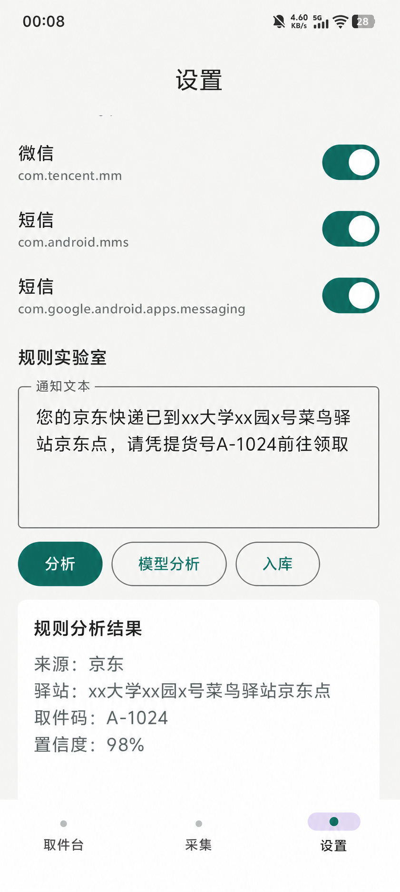

# 取件码整理助手

一个本地优先的 Android 取件信息整理原型。它监听用户授权的通知，把短信、购物 App、微信等通知中的驿站、取件码和时间信息整理成可操作的取件清单，并在设备端完成存储和提醒。

[下载 APK（GitHub Releases）](https://github.com/Ruij-Wang/PickupCodeOrganizerNativeBuild/releases) · [下载端侧模型（同一 Release）](https://github.com/Ruij-Wang/PickupCodeOrganizerNativeBuild/releases) · [查看源码](https://github.com/Ruij-Wang/PickupCodeOrganizerNativeBuild)

> v0.1.0 提供 APK 与端侧模型下载。模型文件不随 APK 打包；可从同一 GitHub Release 单独下载并在 App 内导入。

| 取件台：汇总待取件与取件码 | 采集：确认通知权限与原始通知 |
|---|---|
|  |  |
| **设置：端侧模型已导入并加载** | **规则实验室：查看结构化解析结果** |
|  |  |

## 产品问题

快递取件信息分散在短信、购物 App 和微信通知中。用户需要反复翻找通知、辨认驿站和取件码，也容易错过取件时间。

这个原型把流程缩成四步：

1. 用户授权系统通知访问，并选择需要监听的应用。
2. App 在本地保存新通知并抽取取件信息。
3. 取件码、驿站和状态汇总到统一清单。
4. 用户可标记已取、忽略或手动修正，未取件条目由本地提醒跟进。

## 核心产品决策

- **隐私优先**：不申请 `RECEIVE_SMS`，不直接扫描短信数据库，也不申请网络权限；通知内容和模型推理均留在设备内。
- **规则优先、模型兜底**：高置信度规则结果直接使用；规则置信度不足或没有识别出取件码时，再调用端侧模型。
- **模型与 APK 分离**：App 可以先以规则模式运行，用户需要时再导入 GGUF，避免把数百 MB 模型强制塞进安装包。
- **结果可修正**：模型和规则都可能出错，因此保留原始文本、置信度和详情编辑入口。

## 当前能力

- `NotificationListenerService` 采集通知标题、正文、来源应用和发送时间。
- 白名单默认覆盖京东、淘宝、菜鸟、拼多多、微信及常见短信 App。
- Room 存储原始通知 `RawMessage` 和结构化取件条目 `PickupItem`。
- 本地规则抽取应用归属、驿站地点、取件码和截止日期提示。
- 同来源、同取件码合并，支持未取、已取、忽略状态。
- WorkManager 为未取件条目生成本地提醒。
- Compose UI 包含首页概览、取件列表、详情编辑、采集诊断、监听白名单、规则测试和模型测试。
- 单元测试样本覆盖京东、菜鸟、淘宝、拼多多、短信、微信和异常文本。

## 端侧模型

当前代码已经接入 `llama.cpp` Android 推理库，并实现：

- 从系统文件选择器导入 `Qwen2.5-0.5B-Instruct-Q4_K_S.gguf`。
- 将模型复制到 App 私有目录并加载。
- 在设置页查看模型状态、手动加载和测试抽取结果。
- 在真实通知处理链路中，把端侧模型作为低置信度规则结果的兜底。

默认安装包不包含 GGUF。没有导入模型时，App 自动使用规则引擎；导入并成功加载后，首页会显示“规则 + 本地模型”。

本地发布资产：

| 资产 | 大小 | SHA-256 | 状态 |
|---|---:|---|---|
| `app-debug.apk` | 29.62 MB | `30E0E13171B69B0CCC65663A3EF6B5EBBA7FA92385EA5917EA52AF383812C6E9` | 随 v0.1.0 发布；包含 arm64-v8a 和 x86_64 的 llama/ggml 运行库，仍建议继续真机回归 |
| `Qwen2.5-0.5B-Instruct-Q4_K_S.gguf` | 367.61 MB | `62C51F95D2A1DC8A196FAF41BC0A1952B1A49E92E9476AFE8B131086954FAF1B` | 随 v0.1.0 作为独立模型资产发布 |

## 安装与体验

### 直接安装 APK

1. 从 GitHub Releases 下载 APK 并安装到 Android 设备。
2. 在系统设置中开启“取件码通知整理”的通知访问权限。
3. Android 13 及以上在 App 内授予提醒通知权限。
4. 进入“采集”页确认通知是否进入，再到“取件台”查看结构化结果。

### 启用端侧模型

1. 从同一 GitHub Release 下载 GGUF 模型。
2. 打开 App 的“设置”页，点击“导入模型”。
3. 选择下载的 GGUF，等待复制完成后点击“加载模型”。
4. 使用“模型分析”验证结果；后续低置信度通知会自动尝试模型兜底。

### 从源码运行

1. 安装 Android Studio、JDK 17 和 Android SDK 35。
2. 用 Android Studio 打开本目录并等待 Gradle 同步。
3. 连接 Android 设备或启动模拟器，然后运行 `app`。

## 当前限制

- 最新 APK 仍是 debug 构建，尚未生成正式签名的 release APK。
- 当前环境缺少可用的 JDK、Android SDK 和 ADB，本轮无法完成重新构建与真机回归。
- 端侧模型链路已经实现，但还缺一轮“导入模型—加载—真实通知兜底”的完整设备验证。
- 真机截图已覆盖取件台、采集诊断、模型状态和规则解析；详情编辑与提醒触达流程仍待补充。
- 截止日期语义仍需补充，例如“保管 3 天”“超过 48 小时退回”。

## 技术实现

- Android / Kotlin / Jetpack Compose
- NotificationListenerService
- Room / SQLite
- WorkManager
- llama.cpp Android library
- Qwen2.5 0.5B GGUF
